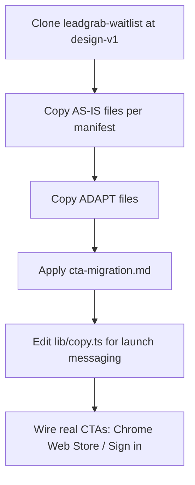

# Product Landing Handoff — LeadGrab (Example)

This folder is the **project-specific instance** of the generic handoff process in `.cursor/templates/product-handoff.md`.

## Files in this folder

| File | Purpose |
|------|---------|
| `file-manifest.md` | Every relevant file: COPY AS-IS / ADAPT / DO NOT COPY |
| `design-tokens.md` | Colors, fonts, spacing, component class patterns |
| `page-structure.md` | Section order, layout shell, anchor IDs |
| `cta-migration.md` | Replace waitlist CTAs with product CTAs |

## Workflow for the product repo

## What stays in this repo only

Waitlist validation plumbing — not part of the product landing:

- `components/waitlist-*.tsx`
- `lib/submit-waitlist-client.ts`
- `lib/email/send-waitlist-confirmation.ts`
- `app/api/waitlist-confirm/`
- Env vars: `WEB3FORMS_ACCESS_KEY`, `RESEND_API_KEY`, `RESEND_FROM_EMAIL`

## What the product landing needs instead

- Primary CTA → Chrome Web Store install link (or extension sideload flow)
- Secondary CTA → Sign in / Dashboard (when auth exists)
- Remove `WaitlistProvider`, modal state, and `onOpenWaitlist` props
- Replace `LandingShell` with a simpler shell (navbar + hero + children, no modal)

## Source repo

- GitHub: https://github.com/suneuron-labs/leadgrab-waitlist
- Design tag: `design-v1` (create after final waitlist polish)
