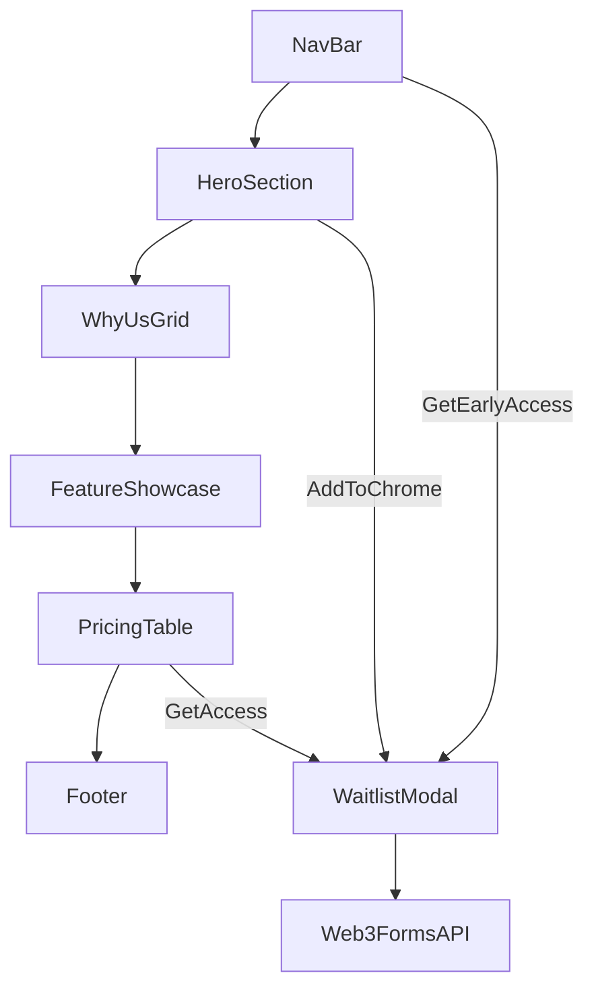

# WA LeadGrab Fake-Door Landing Page — Step-by-Step Plan

## Source Specs

This plan merges three docs:

- [fake-door-page.md](./fake-door-page.md) — **page structure, copy, and section order** (primary blueprint)
- [high-level-spec.md](./high-level-spec.md) — product context, pain points, waitlist framing
- [tech-stack-guidelines.md](../rules/tech-stack-guidelines.md) — stack, dark emerald design system, form rules

**Lead capture:** Web3Forms (not console-only as the rough spec suggests).

**Location:** Everything in `temp/landing/` so the whole folder can be deleted after validation.

---

## How We Build (One Step at a Time)

1. **You say "do Step N"** (or "continue") — I implement only that step
2. **You run `npm run dev`** from `temp/landing/` and confirm it works (agent never starts/stops the server — see [dev-server-control.mdc](../rules/dev-server-control.mdc))
3. **You review** in the browser — approve or request tweaks
4. **Move to the next step** — never skip ahead unless you ask

Current progress is tracked below.

| Step | Status | What |
|------|--------|------|
| 1 | Done | Scaffold `temp/landing/` |
| 2 | Done | Design system + `lib/copy.ts` |
| 3 | Done | Navigation bar |
| 4 | Done | Hero section + mockup |
| 5 | Done | Why Us grid |
| 6 | Done | Feature showcase |
| 7 | Done | Pricing table |
| 8 | Done | Waitlist modal + Web3Forms |
| 9 | Done | FAQ, footer, polish, README |

---

## Full Page Map



| # | Section | Anchor ID | Key content from spec |
|---|---------|-----------|----------------------|
| 1 | Navigation Bar | — | Logo + chat icon, links (Features, How It Works, Pricing, FAQ), "Get Early Access" CTA |
| 2 | Hero Section | — | Pill badge, H1, subheading, "Add to Chrome — Free Beta" button, trust subtext, hero mockup |
| 3 | Why Us Grid | `#features` | 3 pain-point cards: scrambled numbers, selective filtering, always up-to-date |
| 4 | Feature Showcase | `#how-it-works` | Side-by-side: raw contact dump vs organized table |
| 5 | Pricing Table | `#pricing` | Free Trial ($0), Pro Monthly ($12/mo), Pro Annual ($89/yr) |
| 6 | Waitlist Modal | — | Triggered by all CTAs; email form → Web3Forms |
| 7 | FAQ | `#faq` | Minimal FAQ accordion |

---

## Repo Layout

```
temp/landing/
├── app/
│   ├── layout.tsx
│   ├── page.tsx
│   ├── globals.css
│   └── actions/submit-waitlist.ts
├── components/
│   ├── navbar.tsx
│   ├── hero-section.tsx
│   ├── hero-mockup.tsx
│   ├── why-us-grid.tsx
│   ├── feature-showcase.tsx
│   ├── pricing-table.tsx
│   ├── faq-section.tsx
│   ├── waitlist-modal.tsx
│   ├── waitlist-form.tsx
│   ├── footer.tsx
│   └── ui/
├── lib/
│   ├── copy.ts
│   └── validators.ts
├── .env.local.example
└── README.md
```

---

## Step-by-Step Build Order

### Step 1 — Project Scaffold

- Run `create-next-app` inside `temp/landing/`
- Install: `lucide-react`, `react-hook-form`, `zod`, `@hookform/resolvers`
- Create folders: `components/`, `lib/`, `app/actions/`
- **Done when:** `npm run dev` shows default page at `localhost:3000`

### Step 2 — Design System Foundation

- Init shadcn/ui; add Button, Input, Dialog, Card
- Geist Sans, `bg-slate-950 text-slate-100`
- Create `lib/copy.ts` and `lib/validators.ts`
- **Done when:** Dark blank page with correct fonts/colors

### Step 3 — Navigation Bar

- Logo, anchor links, "Get Early Access" CTA, mobile hamburger
- **Done when:** Nav renders and scrolls to anchors

### Step 4 — Hero Section

- Pill, H1, subheading, CTA, trust subtext, CSS mockup
- **Done when:** Hero matches fake-door-page.md copy

### Step 5 — Why Us Grid

- 3 cards at `#features`
- **Done when:** Responsive 3-column grid

### Step 6 — Feature Showcase

- Raw dump vs clean table at `#how-it-works`
- **Done when:** Side-by-side comparison is clear

### Step 7 — Pricing Table

- Free / Pro Monthly / Pro Annual at `#pricing`
- **Done when:** Pro Monthly highlighted

### Step 8 — Waitlist Modal + Web3Forms

- All CTAs open modal; email submits via Server Action
- **Done when:** Web3Forms notification received

### Step 9 — FAQ, Footer, Polish & Docs

- FAQ, footer, smooth scroll, mobile pass, README
- **Done when:** Full page complete and documented

---

## Out of Scope

- Chrome extension, Stripe, auth, database, real screenshots, analytics

---

## Success Criteria

- All 6 sections from fake-door-page.md built in order
- Dark emerald design per tech-stack guidelines
- Every CTA opens the waitlist modal
- Email submits to Web3Forms with loading/success/error states
- Entire app in `temp/landing/` — deletable in one step
- Copy centralized in `lib/copy.ts`
